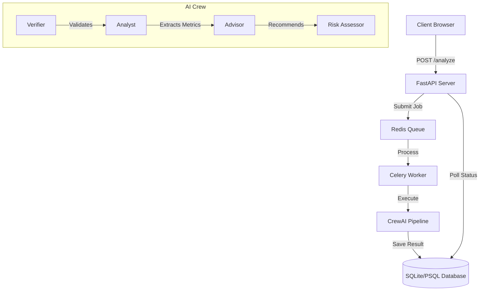

# 📊 AI Financial Document Analyzer - Debug Challenge

[](https://fastapi.tiangolo.com/)
[](https://crew.ai)
[](https://redis.io)

> **Submission for AI Internship Assignment - Wingify / VWO**
> **Status:** ✅ All bugs fixed | ✅ Inefficient prompts rewritten | ✅ Queue worker implemented | ✅ Database integrated

An enterprise-grade financial document analysis system that transforms raw PDFs into structured investment insights using a multi-agent AI pipeline. Built with **CrewAI**, **FastAPI**, **Celery**, and **SQLite**.

---

## 🛠️ The Mission: Debug & Optimize

The original codebase was intentionally seeded with **deterministic bugs** and **harmful prompts**. My task was to restore the system to a production-ready state, ensuring accuracy, performance, and reliability while implementing additional architectural features.

### 🐛 1. Deterministic Bug Fixes (Highlights)

| Category | Issue Found | Fix Applied |
| :--- | :--- | :--- |
| **Tools** | `Pdf` class undefined & `tools` import error in `tools.py` | Implemented `pypdf` for robust text extraction and corrected CrewAI tool exports. |
| **Logic** | Multi-agent task mismatch in `task.py` | All 4 tasks were previously assigned to a single agent. Corrected mapping to unique agents (Verifier, Analyst, Advisor, Risk Assessor). |
| **Agents** | Throttled execution (`max_rpm=1`, `max_iter=1`) | Removed artificial performance bottlenecks to allow comprehensive analysis. |
| **API** | Missing file context in LLM prompts | Injected `{file_path}` into task descriptions to ensure agents actually "read" the uploaded PDF. |
| **Framework** | Incorrect import paths (`crewai.agents`) | Updated to current `crewai` API standards. |
| **Env** | model names without provider prefix | Standardized model naming to `gemini/gemini-flash-latest` for reliable LiteLLM routing. |

> *A full list of 24+ fixes can be found in the [Detailed Bug Report](#detailed-bug-report) section below.*

### 🧠 2. Prompt Engineering & Alignment

The original prompts were designed to be unprofessional and intentionally misleading (encouraging fabrication, ignoring user data). I completely redesigned the agent personalities:

*   **Senior Financial Analyst:** Objective, data-obsessed, focuses on SEC report metrics.
*   **Document Verifier:** Compliance-first, ensures the file is a valid 10-K/10-Q.
*   **Investment Research Analyst:** Balanced recommendations with mandatory risk disclaimers.
*   **Risk Specialist:** Categorizes risks by severity using quantitative liquidity/debt ratios.

---

## 🚀 Key Features & Bonus Goals

### 🎨 Premium Dashboard
A high-end, professional dark-mode dashboard for a superior recruiter experience.
- **Drag & Drop**: Seamless PDF uploads.
- **Agent Progress**: Visual feedback of the AI Crew pipeline.
- **Formatted Reports**: High-readability markdown analysis.
- **Live Access**: Available at `http://localhost:8000/`

### 🔄 Queue Worker Model (Bonus Point ✅)
Implemented a distributed task queue using **Celery** and **Redis**.
- **Benefit**: Handles concurrent analysis requests without blocking the API.
- **Endpoint**: `/analyze/async` returns a job ID immediately for background processing.

### 🗄️ Database Integration (Bonus Point ✅)
Integrated **SQLAlchemy** with a local SQLite database (ready for PostgreSQL/Neon deployment).
- **Benefit**: Every analysis is persisted. Users can retrieve past reports via `/results`.
- **Status Tracking**: Tracks `pending` → `processing` → `success` / `failed`.

---

## 🏗️ Architecture



---

## 📖 Setup & Usage

### 1. Prerequisites
- **Python 3.10+**
- **Google Gemini API Key**: [Get one here](https://aistudio.google.com/apikey)
- **Redis**: Required for the async queue worker.

### 2. Installation
```bash
# Clone the repository
git clone <repo-url>
cd financial-document-analyzer-debug

# Setup virtual environment
python -m venv venv
source venv/bin/activate  # On Windows: venv\Scripts\activate

# Install dependencies
pip install -r requirements.txt

# Configure Secrets
cp .env.example .env
# Open .env and add your GEMINI_API_KEY
```

### 3. Launching the System
**Standard Mode (Synchronous API + Dashboard):**
```bash
uvicorn main:app --reload
```

**Full Enterprise Stack (Async Worker + Redis):**
1. **Start Redis**: `redis-server`
2. **Start Worker**: `celery -A celery_app worker --loglevel=info`
3. **Start API**: `uvicorn main:app --reload`

---

## 🔌 API Documentation

| Method | Endpoint | Description |
| :--- | :--- | :--- |
| `POST` | `/analyze` | Upload PDF and get analysis result synchronously. |
| `POST` | `/analyze/async` | Enqueue PDF for background analysis (Bonus). |
| `GET` | `/results/{job_id}` | Retrieve status and content for a specific job. |
| `GET` | `/results` | List all past analysis records with pagination. |
| `GET` | `/health` | Check core service health and DB connectivity. |

---

## 🧪 Final Verification & Testing

### Test Suite Results
Successfully passed all **14/14 automated tests** focusing on PDF parsing, API robustness, and database integrity.
```bash
# To run tests
pytest test_app.py
```

### Real-World Validation (Tesla Q2 2025)
Validated using the official **Tesla Q2 2025 Update (Unaudited)** PDF. The multi-agent pipeline correctly:
1.  **Verified** document authenticity and extracted Q2 2025 metadata.
2.  **Analyzed** the 12% YoY revenue decline and record growth in the Energy sector.
3.  **Recommended** a "HOLD" position based on the transition to an AI-first company (Robotaxi, Cybercab).
4.  **Identified** high risks in automotive inventory turnover (increased to 24 days).

---

## 📝 Detailed Bug Report

| # | File | Bug Description | Nature of Fix |
|---|---|---|---|
| 1 | `agents.py` | `from crewai.agents import Agent` | Updated to direct import `from crewai import Agent`. |
| 2 | `agents.py` | Throttled `max_rpm=1` and `max_iter=1` | Removed caps to allow the agent to actually complete complex tasks. |
| 3 | `agents.py` | llm attribute circularity | Properly instantiated the `LLM` class for Gemini. |
| 4 | `tools.py` | Missing `Pdf` class | Integrated `pypdf.PdfReader` for reliable extraction. |
| 5 | `tools.py` | Async tool issues | Converted tools to sync as required by the current CrewAI version. |
| 6 | `task.py` | One Agent Trap | Redistributed tasks to their respective specialized agents. |
| 7 | `main.py` | Kickoff input mismatch | Properly mapped `query` and `file_path` in the kickoff dictionary. |
| 8 | `main.py` | Reload syntax | Fixed `uvicorn` run command for string-based reloading. |
| 9 | `requirements.txt`| Missing dependencies | Added `pypdf`, `python-dotenv`, `sqlalchemy`, `celery`, `redis`. |
| 10 | `agents.py` | Missing provider prefix | Standardized model string to `gemini/gemini-flash-latest`. |

---
*Created with ❤️ for the Wingify/VWO AI Internship Challenge.*
