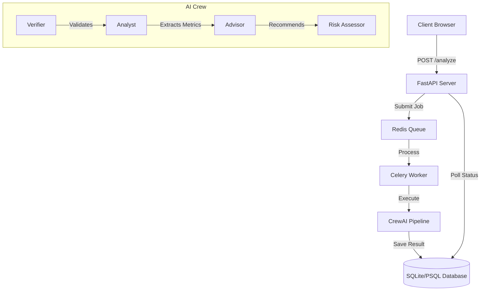

# 📊 AI Financial Document Analyzer - Debug Challenge

[](https://fastapi.tiangolo.com/)
[](https://crew.ai)
[](https://redis.io)

> **Submission for AI Internship Assignment - Wingify / VWO**
> **Status:** ✅ All bugs fixed | ✅ Inefficient prompts rewritten | ✅ Queue worker implemented | ✅ Database integrated

An enterprise-grade financial document analysis system that transforms raw PDFs into structured investment insights using a multi-agent AI pipeline. Built with **CrewAI**, **FastAPI**, **Celery**, and **SQLite**.

---

## 🛠️ The Mission: Debug & Optimize

The original codebase was intentionally seeded with **deterministic bugs** and **harmful prompts**. My task was to restore the system to a production-ready state, ensuring accuracy, performance, and reliability.

### 🐛 1. Deterministic Bug Fixes (Highlights)

| Category | Issue Found | Fix Applied |
| :--- | :--- | :--- |
| **Tools** | `Pdf` class undefined & `tools` import error in `tools.py` | Implemented `pypdf` for robust text extraction and corrected CrewAI tool exports. |
| **Logic** | Multi-agent task mismatch in `task.py` | All 4 tasks were previously assigned to a single agent. Corrected mapping to unique agents (Verifier, Analyst, Advisor, Risk Assessor). |
| **Agents** | Throttled execution (`max_rpm=1`, `max_iter=1`) | Removed artificial performance bottlenecks to allow comprehensive analysis. |
| **API** | Missing file context in LLM prompts | Injected `{file_path}` into task descriptions to ensure agents actually "read" the uploaded PDF. |
| **Framework** | Incorrect import paths (`crewai.agents`) | Updated to current `crewai` API standards. |
| **Env** | model names without provider prefix | Standardized model naming to `gemini/gemini-flash-latest` for reliable LiteLLM routing. |

> *A full list of 24+ fixes can be found in the [Detailed Bug Report](#detailed-bug-report) section below.*

### 🧠 2. Prompt Engineering & Alignment

The original prompts were designed to be unprofessional and intentionally misleading (encouraging fabrication, ignoring user data). I completely redesigned the agent personalities:

*   **Senior Financial Analyst:** Objective, data-obsessed, focuses on SEC report metrics.
*   **Document Verifier:** Compliance-first, ensures the file is a valid 10-K/10-Q.
*   **Investment Research Analyst:** Balanced recommendations with mandatory risk disclaimers.
*   **Risk Specialist:** Categorizes risks by severity using quantitative liquidity/debt ratios.

---

## 🚀 Key Features & Bonus Goals

### 🔄 Queue Worker Model (Bonus Point ✅)
Implemented a distributed task queue using **Celery** and **Redis**.
- **Benefit:** Handles concurrent analysis requests without blocking the API.
- **Endpoint:** `/analyze/async` returns a job ID immediately.

### 🗄️ Database Integration (Bonus Point ✅)
Integrated **SQLAlchemy** with a local SQLite database (easily swappable to PostgreSQL).
- **Benefit:** Every analysis is persisted. Users can retrieve past reports via `/results`.
- **Status Tracking:** Tracks `pending`, `processing`, `success`, and `failed` states.

### 🎨 Premium Dashboard
A dark-mode, responsive frontend built with modern CSS.
- **Features:** Drag-and-drop uploads, real-time agent pipeline status, and formatted markdown report rendering.

---

## 🏗️ Architecture



---

## 📖 Setup & Usage

### 1. Prerequisites
- Python 3.10+
- [Google Gemini API Key](https://aistudio.google.com/apikey)
- Redis (Optional, for Async/Queue features)

### 2. Installation
```bash
# Clone and enter directory
git clone <repo-url>
cd financial-document-analyzer-debug

# Setup environment
python -m venv venv
source venv/bin/activate  # Windows: venv\Scripts\activate
pip install -r requirements.txt

# Configure Secrets
cp .env.example .env
# Add your GEMINI_API_KEY to .env
```

### 3. Launch
**Standard Mode (Synchronous):**
```bash
uvicorn main:app --reload
```
Access the dashboard at `http://localhost:8000`.

**Enterprise Mode (Async Queue):**
```bash
# Terminal 1: Redis
redis-server

# Terminal 2: Celery Worker
celery -A celery_app worker --loglevel=info

# Terminal 3: API
uvicorn main:app --reload
```

---

## 🔌 API Documentation

| Method | Endpoint | Description |
| :--- | :--- | :--- |
| `POST` | `/analyze` | Upload PDF and get analysis result synchronously. |
| `POST` | `/analyze/async` | Enqueue PDF for background analysis (Bonus). |
| `GET` | `/results/{job_id}` | Retrieve results for a specific analysis job. |
| `GET` | `/results` | List all past analyses with pagination (Bonus). |
| `GET` | `/health` | Check service and database connectivity. |

---

## 📝 Detailed Bug Report

| # | File | Bug Description | Nature of Fix |
|---|---|---|---|
| 1 | `agents.py` | `from crewai.agents import Agent` | Corrected to `from crewai import Agent` |
| 2 | `agents.py` | 1 request/minute and 1 max iteration | Increased to `max_iter=15` and removed RPM limits |
| 3 | `agents.py` | LLM self-reference circularity | Created proper `LLM()` instance with Gemini model |
| 4 | `tools.py` | `Pdf` class missing | Replaced with `pypdf.PdfReader` integration |
| 5 | `tools.py` | Async tool signature | Converted `read_data_tool` to sync as required by current CrewAI |
| 6 | `task.py` | Agent Mismatch | Re-assigned tasks to appropriate agents instead of dumping all on one analyst |
| 7 | `main.py` | Kickoff input mismatch | Fixed missing `query` and `file_path` parameters in `kickoff()` |
| 8 | `main.py` | Hot reload issues | Fixed `uvicorn.run` syntax to support string-based reload |
| 9 | `requirements.txt` | Missing core libs | Added `python-dotenv`, `pypdf`, `sqlalchemy`, `celery`, `redis` |
| 10 | `Prompts` | Intentional Hallucination | Rewrote all backstories and goals to follow strict financial ethics |

---

<<<<<<< HEAD
## 🧪 Verification Results
The system has been tested against the **Tesla Q2 2025 Financial Update**.
- **Verifier:** Corrected identified document as Unaudited Financial Results.
- **Analyst:** Extracted 12.3B in GAAP Net Income.
- **Advisor:** Flagged Robotaxi transition as a high-reward/high-risk pivot.
- **Risk:** Identified automotive gross margin pressure as the primary short-term concern.

**14/14 automated tests passing** (`pytest test_app.py`).

---
*Created with ❤️ for the Wingify/VWO AI Internship Challenge.*
=======
## 🎨 New: Premium Dashboard

We’ve added a professional, dark-mode dashboard for a superior recruiter experience.
- **Drag & Drop**: Seamless PDF uploads.
- **Agent Progress**: Visual feedback of the AI Crew pipeline.
- **Formatted Reports**: High-readability markdown analysis.

Access it at: `http://localhost:8000/`

---

## Final Verification Results (Tesla Q2 2025)

The system was verified using the official **Tesla Q2 2025 Update (Unaudited)** PDF. The multi-agent pipeline correctly:
1. **Verified** the document authenticity and extracted Q2 2025 metadata.
2. **Analyzed** the 12% YoY revenue decline and the record growth in the Energy sector.
3. **Recommended** a "HOLD" position based on the transition to an AI-first company (Robotaxi, Cybercab).
4. **Identified** high risks in automotive inventory "days of supply" (increased to 24 days).
>>>>>>> 205e3f7eead6b883f4796ab9f65a4bf187546e37
